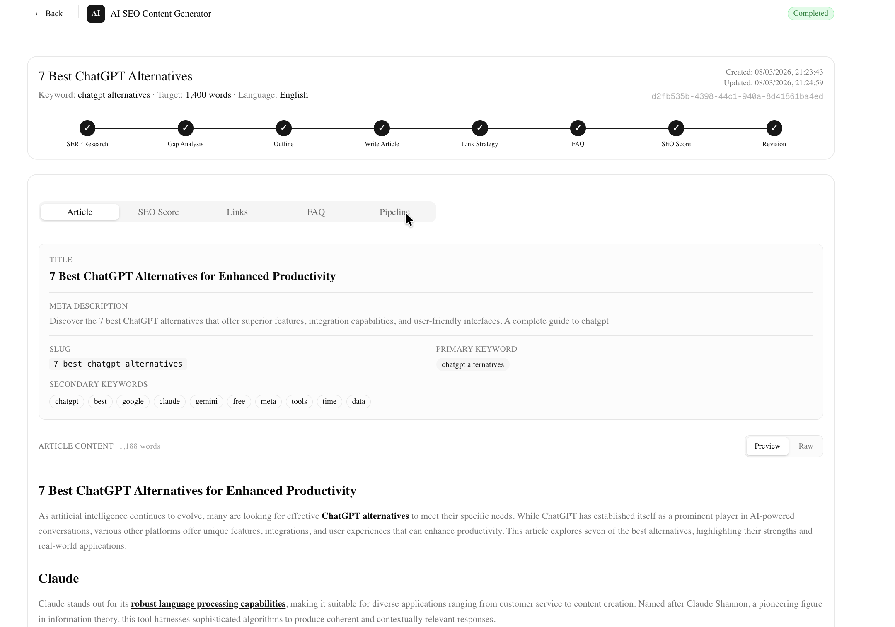

# AI SEO Content Generation Platform

FastAPI backend that generates SEO-optimized articles using a LangGraph agent pipeline. Takes a topic, analyzes top SERP results, scrapes competitor pages, identifies content gaps, and produces publish-ready articles with SEO scoring and automated revisions.



## Quick Start

```bash
git clone <repo-url> && cd aiseo-backend
python3 -m venv venv && source venv/bin/activate
pip install -r requirements.txt
cp .env.example .env    # Add your ANTHROPIC_API_KEY (required)
```

### Run

```bash
# 1. Start the API server
uvicorn app.main:app --reload --port 8000

# 2. Start the worker (separate terminal)
LOG_LEVEL=DEBUG python3 worker.py

# 3. Frontend (optional)
cd frontend && npm install && npm run dev               # :3000
```

> Redis is optional — without it, jobs run in-process as async tasks (no worker needed).

### Generate an Article

```bash
curl -X POST http://localhost:8000/generate \
  -H "Content-Type: application/json" \
  -d '{"topic": "The 7 Best n8n Alternatives in 2025"}'
# → {"job_id": "a20f2ef7-...", "status": "pending"}

curl http://localhost:8000/jobs/a20f2ef7-...
# → {"status": "completed", "result": { ... article JSON ... }}
```

### Tests

```bash
python3 -m pytest tests/ -v
python3 -m pytest --cov=app tests/
```

<details>
<summary>All environment variables</summary>

| Variable | Required | Default | Description |
|----------|----------|---------|-------------|
| `ANTHROPIC_API_KEY` | Yes | — | Claude API key |
| `OPENAI_API_KEY` | No | — | OpenAI fallback key |
| `SERPAPI_KEY` | No | — | SerpAPI key (mock fallback if missing) |
| `REDIS_URL` | No | `redis://localhost:6379/0` | Redis connection |
| `DATABASE_URL` | No | `sqlite:///./jobs.db` | Job persistence DB |
| `LANGGRAPH_DB_PATH` | No | `./checkpoints.db` | LangGraph checkpoint DB |
| `PRIMARY_LLM` | No | `claude-sonnet-4-6` | Primary model |
| `FALLBACK_LLM` | No | `gpt-4o-mini` | Fallback model |
| `SEO_SCORE_THRESHOLD` | No | `75.0` | Min score to pass |
| `MAX_REVISION_COUNT` | No | `3` | Max revision iterations |
| `LOG_LEVEL` | No | `INFO` | `DEBUG` to see LLM prompts |

</details>

## How It Works

```
POST /generate → Job Manager (SQLite) → Redis Queue → LangGraph Pipeline → Article JSON

  START → serp_analyzer → competitor_analyzer → content_classifier → gap_finder
        → outline_generator → article_writer → link_strategist → faq_generator
        → seo_scorer →[score < 75]→ revision_agent → seo_scorer (loop, max 3x)
                     →[score >= 75]→ END
```

Each node persists state via LangGraph's SQLite checkpointing — crashed jobs resume from last completed node.

| Node | Purpose |
|------|---------|
| `serp_analyzer` | Fetches top SERP results via SerpAPI |
| `competitor_analyzer` | Scrapes competitor pages for headings, word counts, structure |
| `content_classifier` | Detects format (listicle/tutorial/comparison/explainer), search intent, subcategories |
| `gap_analyzer` | Identifies content gaps competitors miss |
| `outline_generator` | Builds H2/H3 hierarchy from the classifier's strategy contract |
| `article_writer` | Single-shot (≤2500 words) or multi-shot with rolling context window |
| `link_strategist` | Generates and injects internal/external links into content |
| `faq_generator` | Creates FAQ from People Also Ask data |
| `seo_scorer` | Deterministic SEO validation (no LLM) — 11 checks, 100 points |
| `revision_agent` | Rewrites only sections that failed specific checks |

### Design Decisions

- **Strategy contract** — `content_classifier` outputs a typed `ContentBrief` (search intent, section count, tool names). Downstream nodes consume this directly.
- **Deterministic pre-processing** — Tool extraction, section count math, heading cleanup are code functions, not LLM tasks.
- **Deterministic scoring** — `seo_scorer` is pure Python (no LLM) across 11 criteria. Fully unit-tested.
- **Checkpoint recovery** — Failed jobs resume from last completed node via `/jobs/{id}/retry`.
- **Multi-model support** — Claude primary, OpenAI fallback, abstracted behind `services/llm_service.py`.

### SEO Scoring (11 Checks, 100 Points)

| Check | Pts | Check | Pts |
|-------|-----|-------|-----|
| Keyword in title | 12 | Heading hierarchy (H1→H2→H3) | 8 |
| Keyword in first 100 words | 12 | Internal links ≥ 3 | 8 |
| Keyword density 1-3% | 12 | External links ≥ 2 | 8 |
| Keyword in H2 | 10 | Readability (Flesch > 60) | 5 |
| Word count vs target (±15%) | 10 | Secondary keywords present | 7 |
| Meta description 150-160 chars | 8 | | |

Threshold: **75/100**. Below triggers revision loop (max 3 iterations).

## API

| Method | Path | Description |
|--------|------|-------------|
| `POST` | `/generate` | Create article generation job → 202 with `job_id` |
| `GET` | `/jobs/{id}` | Job status + result (article JSON when completed) |
| `GET` | `/jobs` | List all jobs (newest first) |
| `POST` | `/jobs/{id}/retry` | Resume failed job from last checkpoint |
| `GET` | `/jobs/{id}/history` | Previous attempt snapshots |
| `GET` | `/jobs/{id}/pipeline` | Intermediate artifacts (SERP, classification, gaps, outline, draft) |

**Status progression:** `pending` → `researching` → `outlining` → `drafting` → `scoring` → `revising` → `completed` / `failed`

<details>
<summary>POST /generate request body</summary>

```json
{
  "topic": "The 7 Best n8n Alternatives in 2025",
  "primary_keyword": "n8n alternatives",
  "target_word_count": 1500,
  "language": "en"
}
```

Only `topic` is required. `primary_keyword` defaults to topic, `target_word_count` defaults to 1500.

</details>

<details>
<summary>GET /jobs/{id} response (completed)</summary>

```json
{
  "job_id": "a20f2ef7",
  "status": "completed",
  "result": {
    "metadata": { "title": "...", "meta_description": "...", "slug": "...", "primary_keyword": "...", "secondary_keywords": [] },
    "sections": [{ "heading": "...", "level": "h2", "content": "...", "word_count": 200 }],
    "links": { "internal": [{ "anchor_text": "...", "suggested_url": "/blog/..." }], "external": [{ "anchor_text": "...", "url": "https://..." }] },
    "faq": [{ "question": "...", "answer": "..." }],
    "word_count": 1500,
    "seo_score": { "total": 82.0, "passed": true, "checks": ["..."] },
    "keyword_analysis": { "primary_keyword": "...", "primary_density": 1.8 }
  }
}
```

</details>

## Sample Output

Generated articles in [`docs/sample/`](docs/sample/):

- [The 7 Best n8n Alternatives](docs/sample/the-7-best-n8n-alternatives.md) (listicle)
- [7 Best ChatGPT Alternatives](docs/sample/chatgpt-alternatives.md) (listicle)
- [Prompting Essentials](docs/sample/prompting-essentials-learn-to-use-chatgpt-like-a-pro.md) (tutorial)

## Project Structure

```
app/
├── main.py                    # FastAPI endpoints (6 routes)
├── config.py                  # pydantic-settings
├── queue.py                   # Redis/RQ queue + in-process fallback
├── models/                    # Pydantic data contracts
│   ├── state.py               #   SEOPipelineState (LangGraph)
│   ├── request.py             #   API input
│   ├── article.py             #   Article, SEO metadata, links
│   ├── serp.py                #   SERP results, ContentBrief
│   └── job.py                 #   Job status, responses
├── agents/                    # Pipeline nodes (10)
│   ├── pipeline.py            #   Graph definition
│   ├── serp_analyzer.py       #   SERP fetch
│   ├── competitor_analyzer.py #   Page scraping
│   ├── content_classifier.py  #   Format/intent detection
│   ├── gap_analyzer.py        #   Content gaps
│   ├── outline_gen.py         #   Heading hierarchy
│   ├── article_writer.py      #   Section-by-section writing
│   ├── link_strategist.py     #   Link injection
│   ├── faq_generator.py       #   FAQ generation
│   ├── seo_scorer.py          #   11-check validation
│   └── revision_agent.py      #   Targeted rewrites
├── services/
│   ├── serp_service.py        #   SerpAPI + mock fallback
│   ├── llm_service.py         #   Claude/OpenAI abstraction
│   └── job_manager.py         #   SQLite job persistence
└── utils/
    ├── seo_utils.py           #   Keyword density, Flesch, headings
    ├── serp_utils.py          #   Heading cleanup, tool extraction
    └── text_utils.py          #   Token counting, slugify
tests/
├── test_seo_scorer.py         # 20+ scoring check tests
├── test_api.py                # API integration tests
└── test_services.py           # LLM + SERP service tests
```
